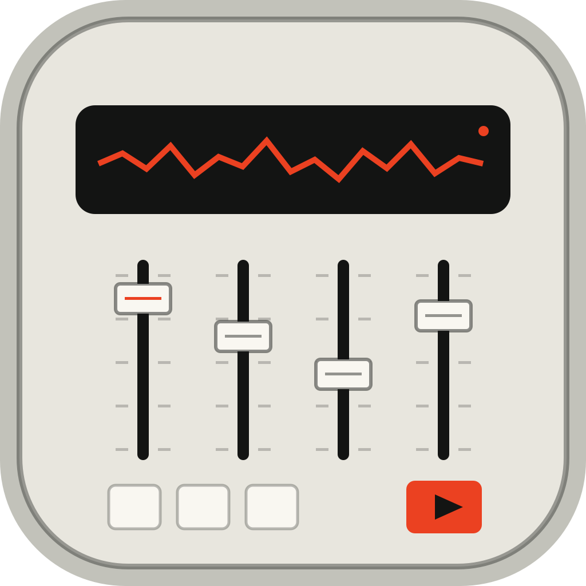
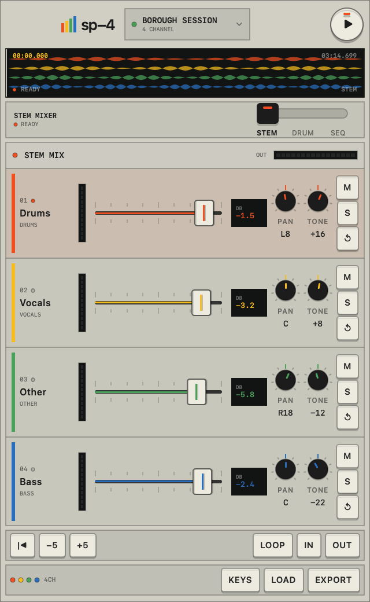
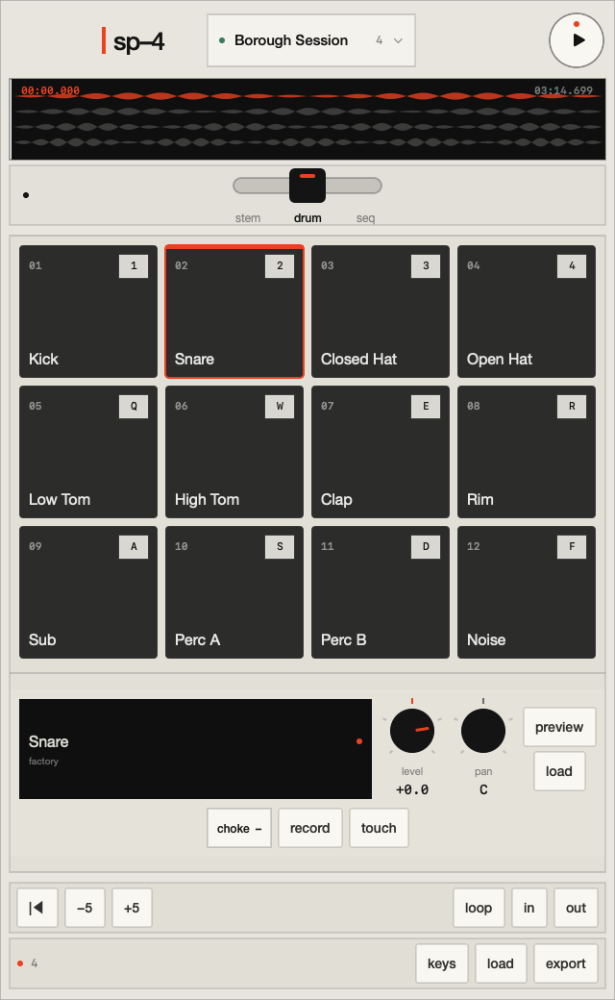
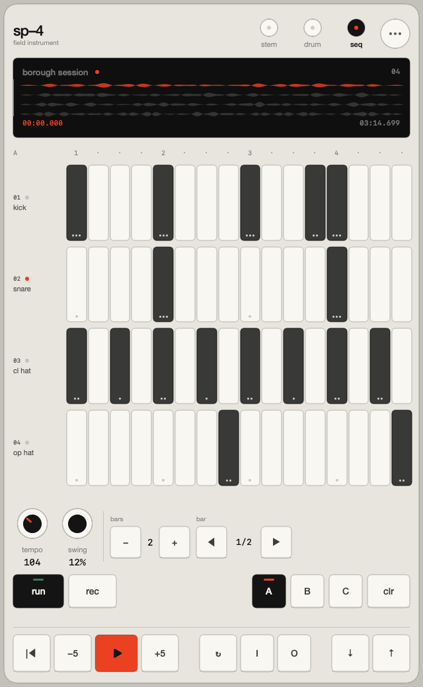

<p align="center">
  
</p>

# Stem Player for macOS

A native macOS app for playing, separating, mixing, looping, and exporting song stems. It also turns a MacBook trackpad or Magic Trackpad into a 4 × 3 multitouch drum pad.



## Features

- Import one song or several prepared stems.
- Play up to four main stems in sync: drums, vocals, other, and bass.
- Control level, pan, tone, mute, and solo for each stem.
- Seek on the waveform and set loop points.
- Separate a song locally with a Core ML model.
- Play twelve drum pads with the mouse, keyboard, or simultaneous trackpad touches.
- Load custom pad samples.
- Record and edit a 16-step drum pattern with tempo, bar, and swing controls.
- Export the stem mix and drum pattern as a 32-bit float WAV file.
- Save portable `.stemproject` packages with copied audio and a versioned JSON manifest.

## Pads and sequencer

<table>
  <tr>
    <td></td>
    <td></td>
  </tr>
  <tr>
    <td align="center">4 × 3 performance pads</td>
    <td align="center">16-step pattern editor</td>
  </tr>
</table>

## Requirements

- Apple silicon Mac
- macOS 14 or newer
- Xcode Command Line Tools 16.4 or newer
- Rust and Cargo
- Internet access for the first stem-separation model download
- FFmpeg is optional and only used when macOS cannot decode a file directly

## Build

```sh
git clone https://github.com/amilcodes/DAW-STEM-Player.git
cd DAW-STEM-Player
make app
open "dist/Stem Player.app"
```

`make app` builds the Rust separation helper, compiles the Swift app, renders the icon, assembles the app bundle, and applies an ad-hoc signature.

The finished app is written to `dist/Stem Player.app`.

## Import audio

Use **+ Audio**, drag files onto the window, or open an audio file with Stem Player from Finder.

One imported file is treated as a full mix. Several files are treated as prepared stems, and their roles are inferred from filenames such as `drums.wav`, `vocals.wav`, and `bass.wav`.

AVFoundation handles WAV, AIFF, CAF, MP3, M4A, and other formats supported by macOS. If native decoding fails and FFmpeg is installed, the app converts the file to a working WAV copy.

## Separate a song

Import one complete song and press **Separate Song**. The Rust helper runs the Core ML separation model and returns four files:

- Drums
- Vocals
- Other
- Bass

The first run downloads the model. Later runs use the local cache. Source audio is not uploaded by this project.

## Trackpad drum input

Open **Pads** and press **Trackpad**, or press `T`.

The pad surface listens to native `NSTouch` events. Each simultaneous contact is mapped to one of twelve screen cells. The initial touch position selects the pad and touch pressure is used as velocity when the device reports it.

The pointer must remain over the pad surface while trackpad mode is active. macOS sends raw touch events to the view under the pointer, and system gestures still belong to macOS.

## Keyboard controls

| Action | Key |
|---|---|
| Play or pause | `Space` or `K` |
| Back or forward five seconds | `J` / `L` |
| Return to start | `Return` |
| Set loop in or out | `I` / `O` |
| Select a stem in Mix | `1`–`4` |
| Adjust selected stem level | `↑` / `↓` |
| Mute or solo selected stem | `M` / `S` |
| Arm or disarm trackpad | `T` |
| Leave trackpad mode | `Escape` |
| Record pattern hits | `Command-R` |
| Export mix | `Command-E` |

Pad keys use the same physical 4 × 3 layout shown on screen:

```text
1 2 3 4
Q W E R
A S D F
```

Open the in-app control reference with `Command-/`.

## Project layout

| Path | Purpose |
|---|---|
| `Sources/StemPlayer/App` | App entry point and menus |
| `Sources/StemPlayer/Audio` | Real-time playback, meters, waveform analysis, and factory drums |
| `Sources/StemPlayer/Input` | Keyboard and multitouch trackpad input |
| `Sources/StemPlayer/Model` | Project models and application state |
| `Sources/StemPlayer/Services` | Import, export, project storage, and separation |
| `Sources/StemPlayer/Views` | SwiftUI instrument views and controls |
| `Helpers/stem-worker` | Rust/Core ML separation process |
| `Tests` | Swift integration tests and model tests |
| `Scripts` | App build, icon render, and test scripts |
| `Legacy/Processing` | Original Java/Processing prototype |

See [docs/ARCHITECTURE.md](docs/ARCHITECTURE.md) for the audio graph, process boundaries, and project format.

## Test

```sh
make test
```

The test command runs the Rust worker tests and a native Swift integration binary. The Swift checks cover model encoding, project packages, generated drums, waveform analysis, audio probing, real-time playback, and offline export. Run audio tests from a normal logged-in macOS session so Audio Unit components are available.

## Privacy and distribution

- Audio stays on the Mac.
- The app has no account system, telemetry, or upload service.
- The included app build is ad-hoc signed for local use.
- Public distribution requires a Developer ID signature and Apple notarization.

## Design note

The interface uses the physical Stem Player's four-part control model and the clear labeling, fixed geometry, and limited color systems common to Teenage Engineering instruments. It does not copy product assets or software from either company.

This is an independent project. It is not affiliated with or endorsed by Kano, Yeezy, or Teenage Engineering.
